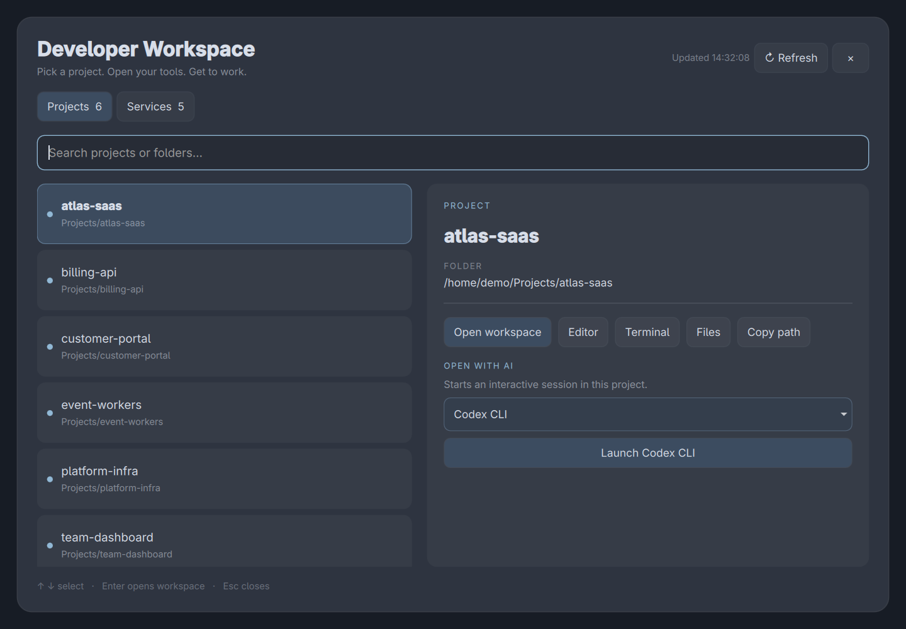
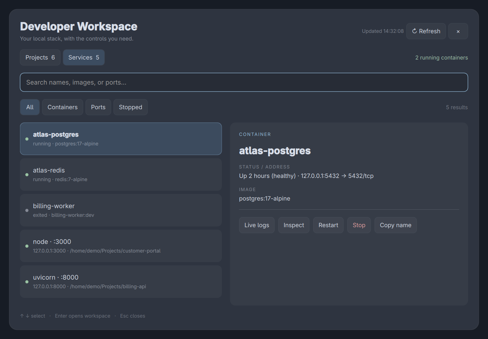

# Omarchy Developer Workspace

A native Quickshell panel for switching projects, launching AI coding assistants,
and managing local development services on Omarchy.

**Projects** — search your repositories, open the editor and terminal, browse files,
copy a path, or launch Codex CLI, Antigravity CLI (`agy`), or Claude Code in the
project folder.

**Services** — filter running and stopped Docker containers and listening TCP
ports. Start, stop, restart, inspect, follow logs, remove a stopped container,
open likely HTTP services, or terminate project-owned processes.

The panel uses a searchable list and detail view, status indicators, action
feedback, and confirmation dialogs for disruptive actions. Services refresh every
five seconds while visible, pausing during actions and confirmations. Updates
keep the selected item, list scroll, and keyboard focus in place.

## Screenshots

Actual native panel captures using **synthetic demo data**. Project names,
container names, paths, process IDs, and timestamps are examples; no private
workspace data is shown.

### Projects and AI launcher



### Development services



The demo values used for these captures are in [docs/demo-data.json](docs/demo-data.json).

## Requirements

- Linux with Omarchy's **Quickshell-based shell** and `omarchy plugin` commands.
  Older Waybar-based Omarchy installations are not supported.
- Python 3.9+; `ss` from iproute2; `uwsm-app`, `xdg-terminal-exec`, and `xdg-open`.
- Ghostty is preferred; other terminals use the default XDG terminal launcher.
- Optional: Docker, `wl-copy` for clipboard actions, `less` for container inspection,
  and any of the supported AI CLIs. Missing AI CLIs are disabled in the dropdown.
- Process termination requires Linux pidfd support and Python's
  `os.pidfd_open` and `signal.pidfd_send_signal`.

No Python packages need to be installed.

## Install

```bash
git clone https://github.com/GitHackerz/omarchy-developer-workspace.git
cd omarchy-developer-workspace
./install.sh
```

The installer writes only to your user configuration, enables the
`developer.workspace` plugin, and preserves your project roots on updates.
It backs up an existing plugin before replacing its code. It does not change
keyboard shortcuts or your bar automatically.

Open projects:

```bash
omarchy-shell shell summon developer.workspace
```

Open services:

```bash
omarchy-shell shell summon developer.workspace '{"mode":"services"}'
```

### Optional shortcuts

Check existing bindings first. If these combinations are unused, add to
`~/.config/hypr/bindings.lua`:

```lua
o.bind("SUPER + ALT + P", "Project switcher", "omarchy-shell shell summon developer.workspace")
o.bind("SUPER + ALT + D", "Development services", [[omarchy-shell shell summon developer.workspace '{"mode":"services"}']])
```

Then validate:

```bash
hyprctl reload
hyprctl configerrors
```

### Optional bar launcher

Add this entry to a section of `bar.layout` in `~/.config/omarchy/shell.json`:

```json
{
  "id": "developer.launcher",
  "type": "command",
  "text": "",
  "tooltip": "Projects · Right-click: services",
  "onClick": "omarchy-shell shell summon developer.workspace",
  "onRightClick": "omarchy-shell shell summon developer.workspace '{\"mode\":\"services\"}'"
}
```

## Configure project discovery

Edit `~/.config/omarchy/plugins/developer.workspace/config.json`:

```json
{
  "projectRoots": ["~/Projects", "~/work"],
  "maxDepth": 4
}
```

Discovery recognizes Git repositories and common Node, Python, Rust, Go, PHP,
and JVM project markers. It skips dependencies and build folders and stops at a
project root, keeping monorepos together. Refresh the panel after changing roots.

## Service controls

- **Stop process** sends SIGTERM; **Force kill** sends SIGKILL. Controls are limited
  to your own listening processes inside configured project folders. Identity is
  checked again before signaling, and pidfds protect against PID reuse.
- **Stop / Restart** interrupt the selected container's clients.
- **Remove** only accepts stopped containers. It deletes the container's writable
  layer and keeps Docker volumes; it never uses force or volume removal flags.
- Docker commands use your existing Docker access; the plugin does not elevate
  privileges. Avoid configuring a remote Docker context if you intend to manage
  only this machine—the Docker CLI follows its active context.
- Port rows can include duplicate IPv4/IPv6 listeners. A Browser button is a
  heuristic based on process name or common web ports, not an HTTP health check.
- Launching a terminal or AI session starts that tool interactively; the plugin
  does not automatically run your project's development scripts.

## Keyboard use

Search filters the current view. Down moves into the list, arrow keys select,
Enter opens the selected project workspace, and Escape closes the panel.
Confirmation dialogs require an explicit button click; Escape cancels them.

## Development

```bash
python3 -m unittest discover -s tests -v
node --test tests/list-sync.test.cjs
bash -n install.sh
```

`plugin/Developer.qml` is the native interface. `plugin/backend.py` discovers
projects/services and executes explicit actions. There is no network server or
external Python dependency. Backend tests mock destructive actions and do not
stop or remove real services.

This is an initial release tested on one Omarchy installation. QML relies on
Omarchy's internal `qs.Commons` theme API, which may change across shell releases.

## Update or uninstall

Pull changes and rerun `./install.sh` to update. To disable:

```bash
omarchy plugin disable developer.workspace
```

After disabling, remove any shortcuts/bar entry you added, then delete
`~/.config/omarchy/plugins/developer.workspace/` if you no longer want its files.

## License

MIT. Contributions and bug reports are welcome.
